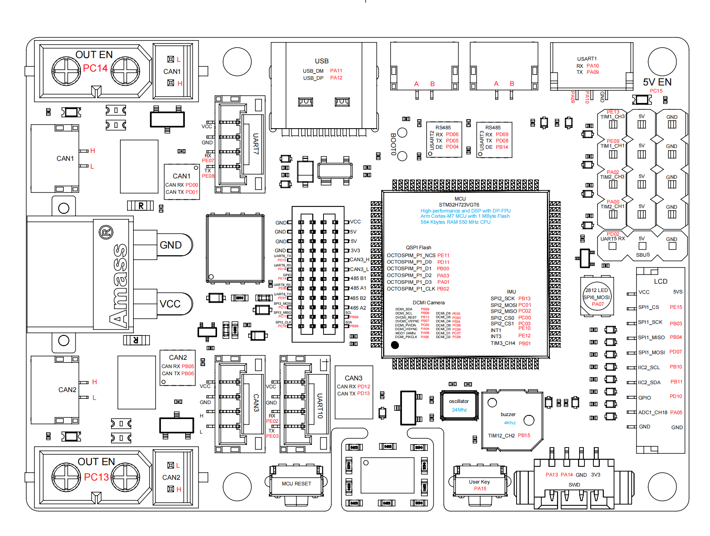
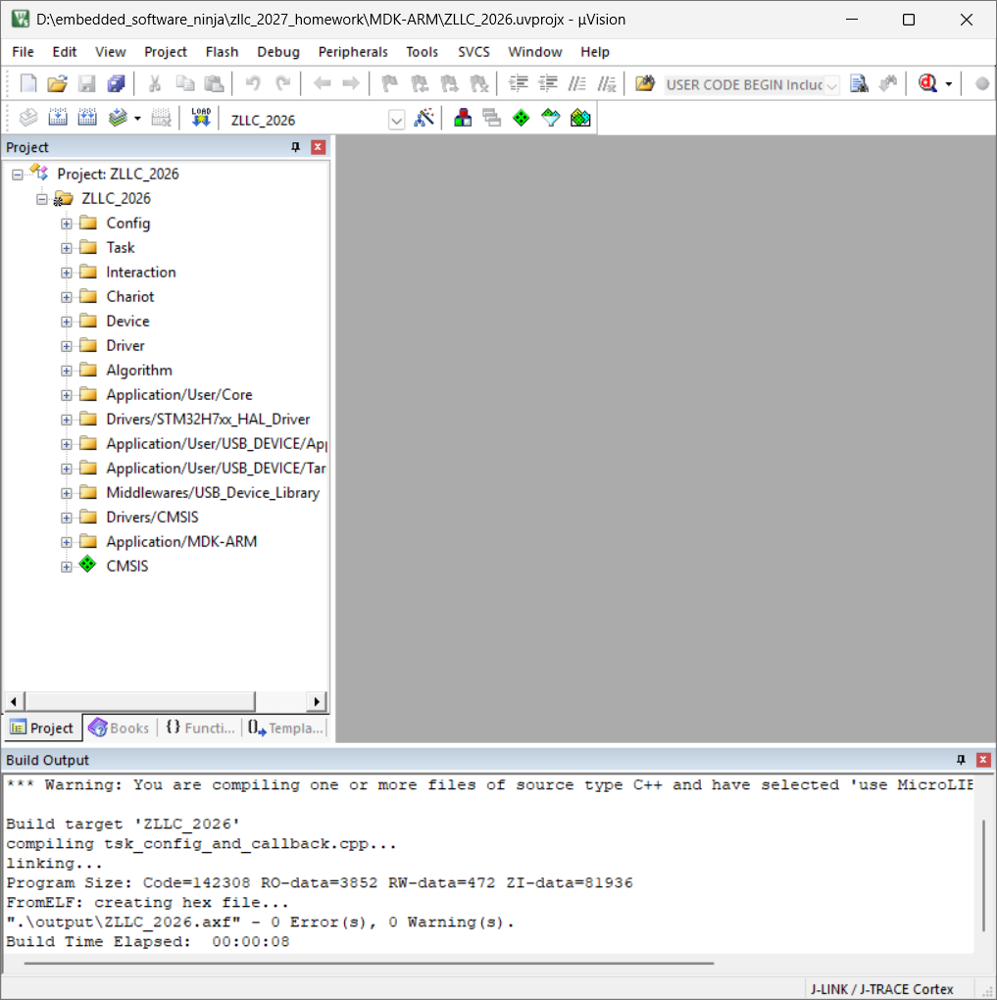

# 征龙凌沧27赛季嵌入式培训


## 学习记录 1：M65 步兵底盘（舵轮）功能恢复

> **任务**：参考学长 26 赛季代码，把训练仓库的底盘运动功能恢复到 M65 步兵（舵轮底盘）
>
> **硬件**：达妙 MC02（STM32H723）。底盘实车接线：CAN1 = 8 个 C620（4 驱动轮 + 4 转向舵）、CAN2 = 超级电容、CAN3 = 自研磁编（舵角）、UART10 = 裁判系统。

### 一、超级电容 CAN 总线适配（CAN3 → CAN2）

**遇到的问题：**
训练仓库代码里超电初始化是 `Supercap.Init(&hfdcan3, 75.f)`，即挂在 CAN3；但 M65 实车的超电接在 **CAN2**。不改的话超电收发会落在错误的总线上。

**排查 / 确认：**
查达妙 MC02 官方板图的引脚定义，确认丝印 CAN 接口与芯片 FDCAN 外设的对应关系：

| 丝印接口 | 引脚（RX/TX） | 对应外设 |
| --- | --- | --- |
| CAN1 | PD0 / PD1 | FDCAN1 (`hfdcan1`) |
| CAN2 | PB5 / PB6 | FDCAN2 (`hfdcan2`) |
| CAN3 | PD12 / PD13 | FDCAN3 (`hfdcan3`) |



即三个接口干净 1:1 对应 `hfdcan1/2/3`，确认超电应使用 `hfdcan2`。

**解决办法（发送 + 接收两侧都要改）：**

1. `crt_chassis.cpp` 的 `Init` 里（发送 / 绑定侧）：
   ```cpp
   // 改前
   Supercap.Init(&hfdcan3, 75.f);
   // 改后
   Supercap.Init(&hfdcan2, 75.f);
   ```
2. `tsk_config_and_callback.cpp` 里（接收侧）：超电接收 `case 0x67` 原本在 CAN3 回调里，M65 在 CAN2，于是移到 `Chassis_Device_CAN2_Callback`：
   ```cpp
   case (0x67): // 超电接收
       chariot.Chassis.Supercap.CAN_RxCpltCallback(CAN_RxMessage->Data);
       break;
   ```

**收获：** 代码里一行"挂哪条总线"的配置，背后对应的就是板子上一个具体接口、一组引脚。查板图把 **软件配置 ↔ 芯片外设 ↔ 板上接口** 对应起来，才能确认改得对——读软件反而进一步加深了我对硬件电气连接的理解。

### 二、舵角磁编（MA600）派发补全

**遇到的问题：**
舵轮底盘要靠磁编读舵角做闭环。但训练仓库里 `Chassis_Device_CAN3_Callback`（CAN3 接收回调）是个**空函数 `{}`**——磁编的 CAN 帧收进来后没有任何派发，`MA600_Data_Process` 永远不会被调用，`MA600_Status` 一直是 DISABLE，**舵角反馈是死的**。

**代码链路梳理（理解磁编数据怎么变成舵角）：**

1. 磁编在 **CAN3** 发帧，每个舵一个 ID：`0xD1 ~ 0xD4`；
2. `drv_can.cpp` 的 `HAL_FDCAN_RxFifo0Callback` 按总线收下，调用 CAN3 注册的回调；
3. CAN3 回调按 CAN ID 派发，调 `Motor_Steer[i].MA600_Data_Process(帧)`；
4. `MA600_Data_Process` 解析单圈 / 多圈 / 角速度（`Data[1..6]`，每个 `×(-1)/100`），算出
   `Zero_Offset_Radian = Normalize(单圈角 − 零点)`；
5. 底盘每周期用 `Get_Now_Zero_Offset_Radian()` 作为**权威舵角**（估速、优劣弧解算、力解算都用它），并 `Set_Transform_Radian()` 喂给舵电机角度环；
6. 舵电机 `AGV_MODE` 串级：**角度环反馈用磁编角，速度环反馈用电机自身转速**（避免磁编差分测速不准）；
7. `ita_chariot.cpp` 周期调用 `TIM_Alive_PeriodElapsedCallback_MA600()` 做磁编掉线检测。

**解决办法：** 把空的 CAN3 回调补全，将 4 个磁编 ID 派发到对应舵电机：
```cpp
void Chassis_Device_CAN3_Callback(Struct_CAN_Rx_Buffer *CAN_RxMessage)
{
    switch (CAN_RxMessage->Header.Identifier)
    {
        case (0xD1): chariot.Chassis.Motor_Steer[0].MA600_Data_Process(CAN_RxMessage); break;
        case (0xD2): chariot.Chassis.Motor_Steer[1].MA600_Data_Process(CAN_RxMessage); break;
        case (0xD3): chariot.Chassis.Motor_Steer[2].MA600_Data_Process(CAN_RxMessage); break;
        case (0xD4): chariot.Chassis.Motor_Steer[3].MA600_Data_Process(CAN_RxMessage); break;
    }
}
```

**收获：** 一条 sensor → 控制的完整数据通路会横跨 **驱动层(drv_can) → 设备层(dvc_djimotor) → 应用层(crt_chassis) → 交互层(ita_chariot)**。只看单个文件会误以为"这函数没东西调用"，但其实要顺着 CAN 的注册（`CAN_Init`）和按 ID 派发，才能把链路接通。

### 三、其余移植改动

- `crt_chassis.h / .cpp`：由四轮 `Class_Tricycle_Chassis` 换为舵轮 `Class_Steering_Wheel_Chassis`；
- `ita_chariot.h`：底盘对象类型改为 `Class_Steering_Wheel_Chassis`；
- `ita_chariot.cpp`：`Chassis_Control_Type_SPIN` → `Chassis_Control_Type_SPIN_Positive`；
- 以上改动 Keil 编译 **0 Error / 0 Warning**。



### 四、待上车验证（TODO）

- 舵电机零点标定 `Set_Zero_Position`（需实车逐个标定）

---

## 学习记录 2：底盘核心解算流程理解

> 这次不是改代码，而是把学长舵轮底盘的运动解算流程读懂，为后续上车标定、调参打基础。对底盘主循环整体的理解：**把操作手的速度指令，一步步解算成每个电机的输出。**

### 一、总体流程（`TIM_Calculate_PeriodElapsedCallback`）

底盘主循环由定时器按固定周期（约 1ms）反复调用，每次按顺序跑完整套控制：

```
斜坡平滑目标速度 -> 卡尔曼估真实车速 -> 舵角解算 -> 力解算 -> 功率限制 -> 下发电机
```

- **斜坡平滑**：把目标速度过一遍斜坡函数，避免突变导致打滑、抖动；
- **卡尔曼估速** `Chassis_Speed_Estimate`：估出底盘当前真实速度，作为后面 PID 的反馈；
- 失能（DISABLE）模式下所有电机置零、清积分，安全停车。

### 二、舵角解算（`Stree_Angle_Resolution`）

决定每个舵轮**朝哪个方向、目标转多快**。核心思想：每个轮的速度 = **整车平移** + **整车自转**（ω 乘以 r）两部分的矢量和。

- 把这两部分在该轮位置叠加成一个速度矢量；
- 矢量的**方向**就是舵该转到的角度（`atan2`），**模长**就是驱动轮的目标速度；
- **优劣弧优化**：如果算出来要转的角度超过 90 度，就让舵转到**相反方向**、同时把轮速**取反**——结果一样，但舵少转一大截、响应更快；
- 怠速时把四个轮摆成 X 形，起到锁车作用。

### 三、力解算（`Force_Speed_Resolution`）

决定每个**驱动轮出多大力 / 扭矩**。这套代码用的是**力控（扭矩控制）**，不是各轮独立速度环。分四步：

1. **整车速度 PID -> 期望合力**：对 Vx、Vy、ω 各跑一个 PID，反馈用卡尔曼估出的真实车速，输出当作“整车要施加的合力 Fx、Fy 与力矩 τ”；
2. **坐标变换（跟随云台）**：把合力按“底盘朝向与参考方向之差 `derta_angle`”旋转到底盘自己的坐标系——这就是底盘跟随云台的来源；
3. **分配到每个轮**：每个轮只能沿当前舵向出力，于是把合力投影到各轮舵向：
   ```
   tmp_force[i] = Fx*cos(θ_i) + Fy*sin(θ_i) + (τ / R_DIST)*cos(Azimuth_i - θ_i)
   ```
   （`θ_i` 为该轮当前舵角，来自磁编）前半是平移分量、后半是自转分量，四轮合起来正好等于整车想要的力 + 力矩；
4. **力 -> 扭矩 + 前馈**：`扭矩 = 力 * 轮半径`，再加“目标轮速 - 实际轮速”的跟踪项和**动摩擦前馈**（正转加、反转减、近零线性过渡），最后以扭矩模式下发。

**这么做的原因**：先算整车合力、再分配到各轮、扭矩模式下发，好处是四轮协调一致地分担同一需求，也便于紧接着**统一做功率限制**。

### 四、涉及的机械常量（M65 待核实）

力解算里用到几个机械常量，上车前要按 M65 实测 / 确认，否则出力和转向会偏：

- `WHEEL_RADIUS`：轮半径（力转扭矩用，错了出力大小不对）；
- `R_DIST`：底盘中心到轮的距离（自转力分配用）；
- `Wheel_Azimuth[i]`：每个轮的安装方位角（自转力分配用，错了车转不正 / 走偏）。

### 小结

读懂这条解算流程后，我对底盘“指令怎么变成电机输出”有了整体认识：**速度指令 -> PID 算合力 -> 坐标变换 -> 按舵向分配 -> 转扭矩下发**。也清楚了后续上车要标定 / 调的参数分别影响哪一步。

## 学习记录 3：功率限制理解（转向优先分配）

> 接着上一篇的解算流程往下读。力解算算出每个电机“想出多大扭矩”后，下发前还要过一道**功率限制**，保证整车不超裁判系统/超电给的功率预算。算法本体在 `User/Algorithm/Src/alg_new_power_limit.cpp` 的 `Power_Task`，由 `crt_chassis.cpp` 调用。

> 补充：工程里还有个旧版 `alg_power_limit.cpp`（没用上）。一开始搜 `Power_Task` 发现旧版里根本没有这个函数，才定位到真正在用的是 `alg_new_power_limit.cpp`——读代码前先确认“到底用哪一版”很重要。

### 一、单电机功率模型

预测一个电机大概消耗多少功率（`Calculate_Theoretical_Power`）：

```
cmdPower = k4*ω*τ      // 机械功率
         + k1*|ω|       // 转速相关损耗
         + k2*τ*τ       // 电流/铜损
         + k3           // 常数损耗
```

ω 是转速、τ 是扭矩。8 个电机各算一遍，得到每个的理论功率。

### 二、分配缩放（转向舵优先）

不是把 8 个电机一起按同一比例压，而是**分驱动和转向两拨，有优先级**：

- 先按“驱动 vs 转向”分别累加理论功率；
- **转向舵先分，且额度给到总预算的 80%**（`dir_power_limit = Max_Power * 0.8`）：
  - 转向需求没超 80% -> 转向**全额满足**，剩余全留给驱动轮；
  - 转向需求超了 -> 转向按比例压到 80%，驱动轮只能用剩下的 20%；
- **驱动轮再分剩余额度**：超了按比例压，没超就满额。

**为什么转向优先**：舵转不到位，车就往错误方向跑。所以宁可先保证方向对，把大头功率给转向，再把剩余分给决定“跑多快”的驱动轮。这是舵轮底盘一个关键的取舍。

### 三、反解扭矩

知道某个电机“只准用这么多功率”后，反过来求它最多能出多大扭矩（`Calculate_Toque`）：把功率模型当成一个关于扭矩的**一元二次方程**，用求根公式解出对应扭矩（判别式 < 0 就给 0），再乘 `GET_TORQUE_TO_CMD_CURRENT` 转成指令电流，最后**限幅到 ±16384**（C620 电流满量程）下发。

### 四、两个细节

- **反向放电不参与分配**：理论功率 < 0 的电机（在减速、当发电机往回充能）直接用原输出，不去压它——它不耗功率，反而是缓冲；
- 代码里还预留了“按误差分配”“RLS 在线辨识 k 参数”的逻辑，但目前都注释掉了，实际走的是上面这套固定 80/20 分配。

### 小结：整条功率线闭环

`crt_chassis` 打包 8 个电机数据 + 定预算 `Max_Power`（来自改到 CAN2 的超电）-> `Power_Task`：算理论功率 -> 转向舵优先、驱动轮吃剩余地分配 -> 反解每个电机的限制扭矩 -> 写回 output -> `crt_chassis` 再 `Set_Out` 下发。

至此底盘“速度指令 -> 解算 -> 功率限制 -> 下发”这条主线读通了